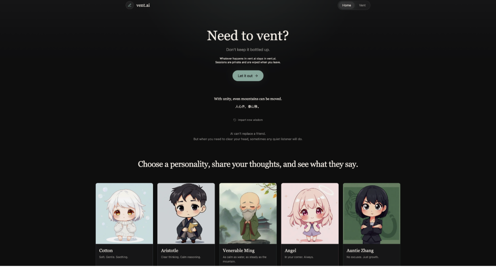
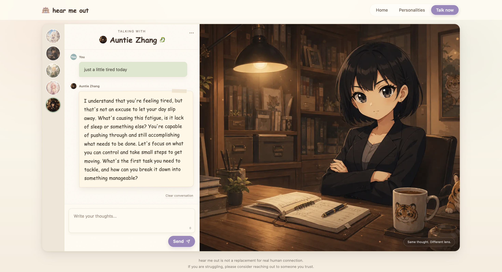

# vent.ai

Same thought. Different lens.

vent.ai is an ephemeral AI reflection app for writing what is on your mind and hearing it reflected through distinct personality perspectives. It is designed to feel calm, private, and lightweight: no accounts, no saved history, and no durable conversation storage.

## Preview

<p align="center">
  
  <br>
vent.ai home page</em>
</p>
<br>
<p align="center">
  
  <br>
Angel in action :) 
</em>
</p>


## Tech Stack

- **Framework:** Next.js App Router
- **Language:** TypeScript
- **Frontend:** React
- **Styling:** Tailwind CSS
- **Animation:** Framer Motion
- **State:** Zustand
- **AI:** Groq SDK
- **Queue and Rate Limiting:** Upstash Redis and Upstash Ratelimit
- **Worker:** Separately runnable Node.js inference worker
- **API:** Next.js route handler at `/api/chat`

## How It Works

The user starts on the landing page, chooses a personality, and writes a thought on `/vent`.

The `/vent` route shows `PersonalitySelector`, `VentInput`, and the optional first-prompt `PersonaSuggestionInput`. The user can manually choose any of the five personalities at any time. If the user writes into the helper input and presses Enter, a local weighted heuristic can suggest a lens and the suggested switch immediately submits the prompt.

Submitting the text shows `ResponsePanel`, which streams the selected personality first and keeps generated responses in Zustand memory for instant tab switching. The client also keeps a temporary in-memory session message list so long sessions can retain continuity without writing vents to storage.

With Redis configured, `/api/chat` validates and enqueues the anonymous request, then returns a short-lived job ID. A separate worker applies context compression, safety-aware routing, and persona selection before streaming provider output into a replayable Redis event stream. The browser consumes those events over SSE. There are no accounts, saved sessions, profiles, titles, durable history, or localStorage persistence.

## Privacy-first LLM architecture

vent.ai is anonymous and session-local:

- Anonymous sessions with no accounts.
- No durable vent history or user database. Worker job payloads expire from Redis after a short TTL.
- Manual persona selection remains the primary control.
- Optional persona suggestion uses a free local heuristic in `lib/ai/persona-router.ts`.
- Safety-aware response routing runs before generation. When Groq is configured, a small classifier checks every message before the main response; local heuristics remain as fallback and for the first-prompt helper.
- Progressive context compression summarizes older turns for the active Zustand session, then trims older raw turns from the client.
- Groq remains the main AI provider behind a provider-neutral completion and streaming interface.
- Correlation IDs connect API enqueue logs, Redis jobs, worker logs, and SSE responses.
- Redis/Upstash provides rate limiting, idempotent job creation, worker queueing, and replayable token events when configured.

Architecture flow:

```text
User vent
 -> optional persona suggestion
 -> idempotent Redis job
 -> worker safety routing and temporary context compression
 -> Groq streaming into Redis events
 -> reconnectable SSE response
 -> session clears when user leaves, refreshes, or resets
```

The active conversation remains in browser memory. Redis temporarily stores only queued inference payloads and events with a rolling 15-minute TTL. Refreshing or closing the tab clears the current vent and responses.

The backend separates HTTP transport, Redis job storage, worker execution, chat orchestration, the ephemeral conversation domain, and the Groq adapter. See [Architecture](docs/architecture.md) for the request lifecycle and dependency rules.

## Getting Started

Install dependencies:

```bash
npm install
```

Create a local environment file:

```bash
cp .env.example .env.local
```

Run the development server:

```bash
npm run dev
```

When the Upstash variables are configured, run the inference worker in a second terminal:

```bash
npm run worker
```

Open:

```bash
http://localhost:3000
```

## Environment Variables

```bash
GROQ_API_KEY= EXAMPLE_KEY
NEXT_PUBLIC_APP_URL=http://localhost:3000
UPSTASH_REDIS_REST_URL= EXAMPLE_KEY
UPSTASH_REDIS_REST_TOKEN= EXAMPLE_KEY
```

`GROQ_API_KEY` is optional for local UI work. Without it, the app uses mock, hard-coded responses.

The Upstash variables are optional for credential-free UI development. When present, `/api/chat` uses the Redis worker queue and the separately running worker is required. Without them, the app retains its direct streaming fallback.

## Scripts

```bash
npm run dev
npm run worker
npm run lint
npm run typecheck
npm test
npm run build
```

## Not a Substitute for Support

vent.ai is a reflective journaling interface. It should never present itself as treatment, diagnosis, crisis care, or a replacement for trusted people and emergency services. The global prompt rules in `lib/personalities.ts` apply to every personality, including the firmer Auntie Zhang mode.
